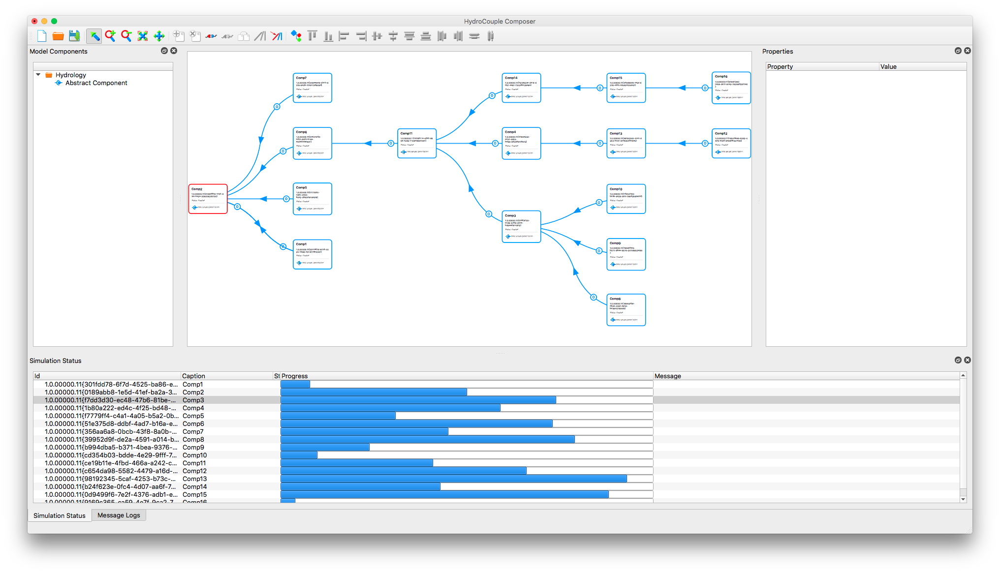

# HydroCoupleComposer

[](https://github.com/HydroCouple/HydroCouple/blob/master/License.md)

HydroCoupleComposer is a cross platform GUI and CLI for creating and executing HydroCouple coupled model compositions. It can be launched using MPI for compositions containing components that support MPI using the following command:

```
mpirun -np 3 ./HydroCoupleComposer -r inputfile.hcp --ng
```

Type the following command for more help:

```bash
./HydroCoupleComposer -h
```



## Installers

* [Windows 64 bit](https://github.com/HydroCouple/HydroCoupleComposer/releases/download/v1.2.1/HydroCoupleComposer.msi)

* OSX

## Composition Examples

* [Logan River Temperature Calibration](https://github.com/HydroCouple/HydroCoupleComposer/releases/download/untagged-806d32a0e47c1ba750f0/Logan_River_Example.zip)

## Depedencies

HydroCoupleComposer can be compiled using the QtCreator project file included with this project or in visual studio using the Qt Visual Studio AddIn. Work is ongoing to add a CMake make file. Modify the project file to make sure that it points to the appropriate libraries on the target machine. Compilation of HydroCoupleComposer requires the following frameworks and libraries:

# Required Libraries

* Qt 5.7.0
* [QPropertyModel](https://github.com/HydroCouple/QPropertyModel)
* [HydroCoupleVis](https://github.com/HydroCouple/HydroCoupleVis)

# Optional Libraries
* MPI
* Graphviz
* OpenMP

## References
-------------------------------------------------------------------------------------------------------------------
Buahin, C. and J. Horsburgh, 2016. From OpenMI to HydroCouple: Advancing OpenMI to Support Experimental Simulations and Standard Geospatial Datasets. International Congress on Environmental Modelling and Software. Toulouse, France. http://scholarsarchive.byu.edu/iemssconference/2016/Stream-A/11

Buahin, C. A., Horsburgh, J. S., and Neilson, B. T. (2018). “Enabling High-Performance Heterogeneous Computing for Component-Based Integrated Water Modeling Frameworks.”9th International Congress on Environmental Modelling and Software, Modelling for Sustainable Food-Energy-Water Systems, Fort Collins, Colorado, USA.

Buahin, C.A., Horsburgh, J.S., 2018. Advancing the Open Modeling Interface (OpenMI) for integrated water resources modeling. Environmental Modelling & Software 108, 133–153. https://doi.org/10.1016/j.envsoft.2018.07.015

Buahin, C.A., Horsburgh, J.S., Neilson, B.T., 2019. Parallel multi-objective calibration of a component-based river temperature model. Environmental Modelling & Software 116, 57–71. https://doi.org/10.1016/j.envsoft.2019.02.012
